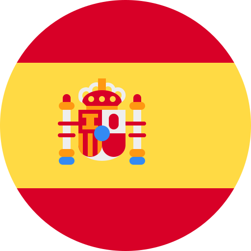
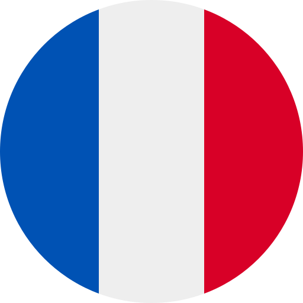
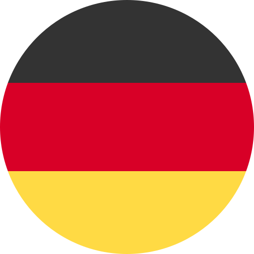
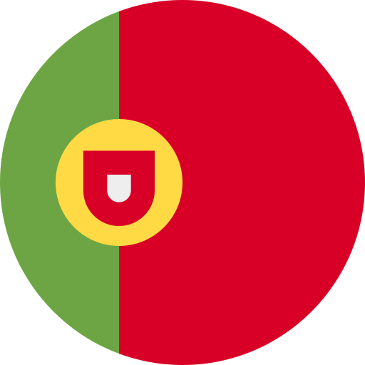
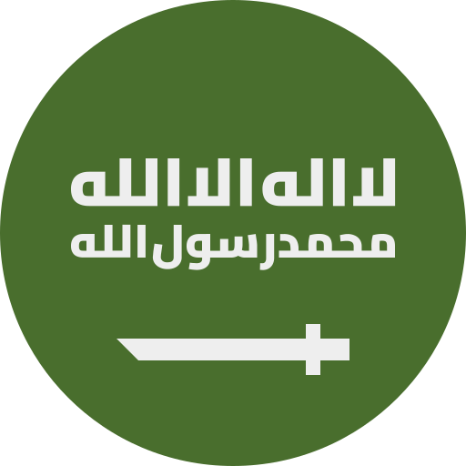
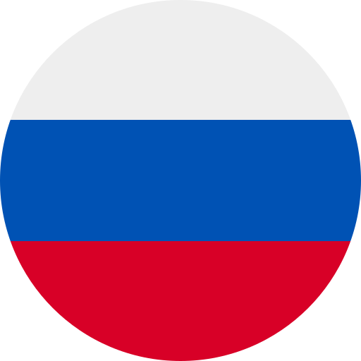

  
  
  # Tabulosa
  
  **每次打开新标签页，学习一个新单词**
  
  将你的浏览习惯转化为高效的语言学习体验。
  
  [English Documentation](./README.md)

---

## 应用截图

  
  
  *简洁优雅的设计，奶油色背景搭配衬线字体*

  
  
  *自定义语言、等级和学习模式*

---

## 功能特点

- **支持 11 种语言** - 西班牙语、法语、德语、意大利语、葡萄牙语、日语、韩语、中文、阿拉伯语、俄语和印地语
- **简洁优雅的设计** - 奶油色背景搭配衬线字体，无干扰学习体验
- **离线可用** - 所有词汇本地存储，无需网络
- **智能分级系统** - 所有语言支持 CEFR 等级（A1-C2），日语额外支持 JLPT 等级（N5-N1）

---

## 支持的语言

<table>
  <tr>
    <td align="center" width="50%">
       
      <strong>西班牙语</strong> 
      Español · A1-C2
    </td>
    <td align="center" width="50%">
       
      <strong>法语</strong> 
      Français · A1-C2
    </td>
  </tr>
  <tr>
    <td align="center">
       
      <strong>德语</strong> 
      Deutsch · A1-C2
    </td>
    <td align="center">
       
      <strong>意大利语</strong> 
      Italiano · A1-C2
    </td>
  </tr>
  <tr>
    <td align="center">
       
      <strong>葡萄牙语</strong> 
      Português · A1-C2
    </td>
    <td align="center">
       
      <strong>日语</strong> 
      日本語 · JLPT N5-N1
    </td>
  </tr>
  <tr>
    <td align="center">
       
      <strong>韩语</strong> 
      한국어 · A1-C2
    </td>
    <td align="center">
       
      <strong>中文</strong> 
      中文 · A1-C2
    </td>
  </tr>
  <tr>
    <td align="center">
       
      <strong>阿拉伯语</strong> 
      العربية · A1-C2
    </td>
    <td align="center">
       
      <strong>俄语</strong> 
      Русский · A1-C2
    </td>
  </tr>
  <tr>
    <td align="center">
       
      <strong>印地语</strong> 
      हिन्दी · A1-C2
    </td>
    <td></td>
  </tr>
</table>

---

## 致谢

- 灵感来源于 [the-tab-of-words](https://github.com/kahosan/the-tab-of-words)
- 词汇数据（日语除外）来自 [Language-Learning-decks](https://github.com/vbvss199/Language-Learning-decks)
- 日语词汇数据来自 [Ankidrone Essentials](https://tatsumoto.neocities.org/blog/ankidrone-essentials)

## 许可证

MIT License
